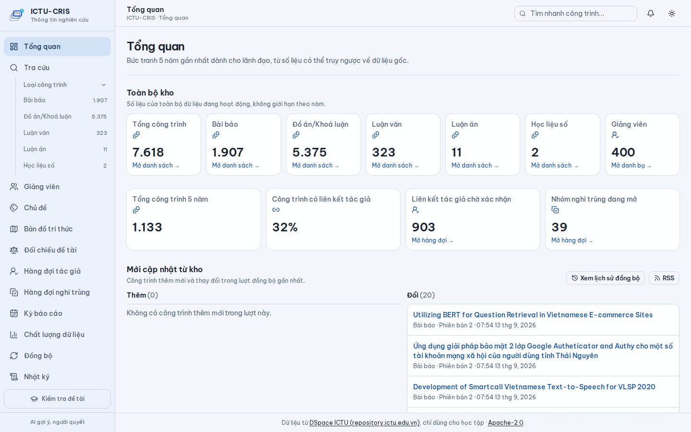
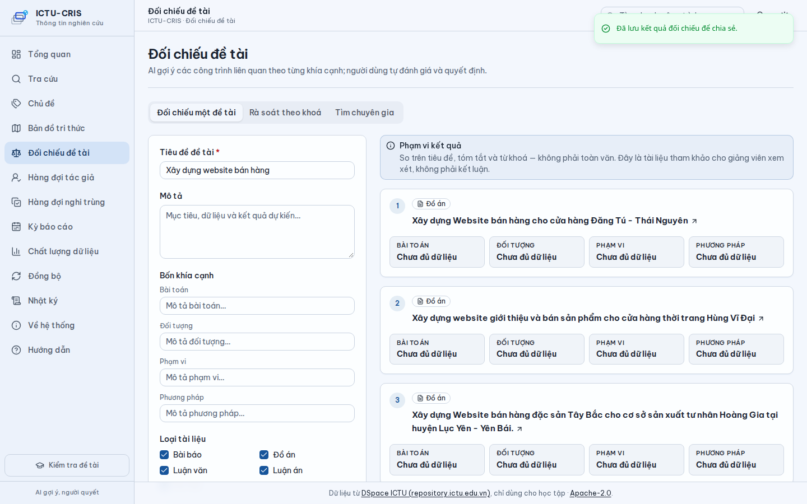
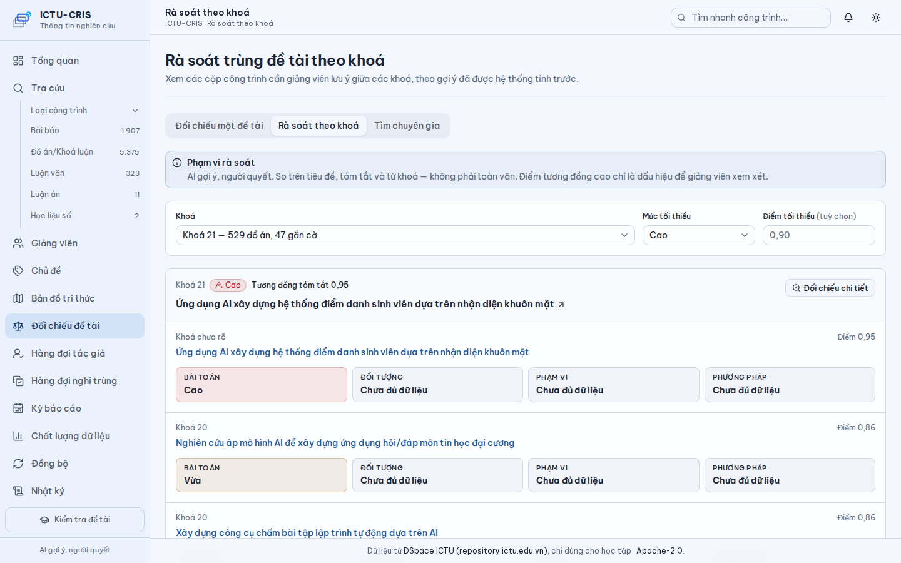
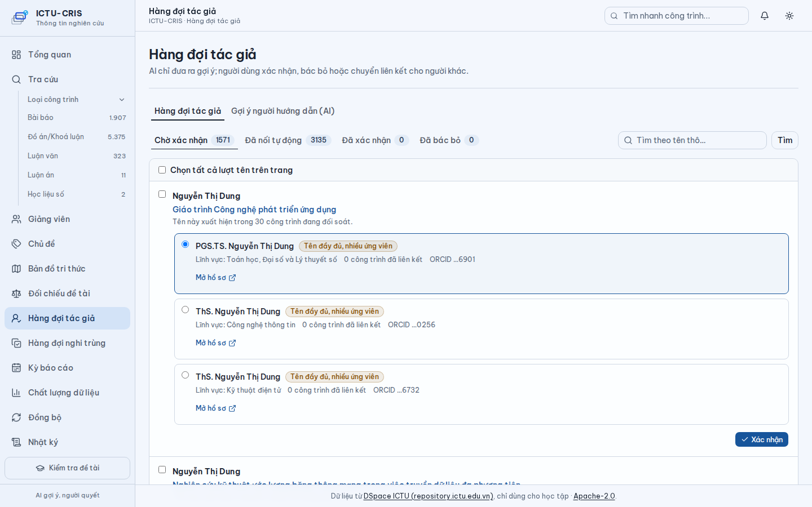
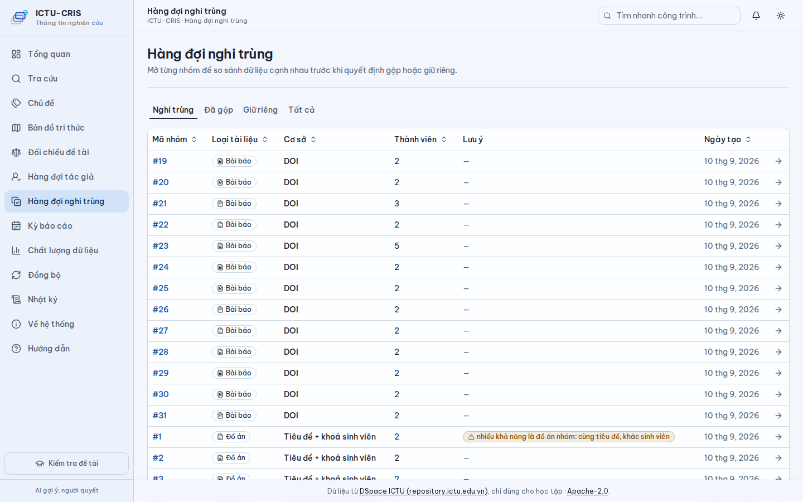
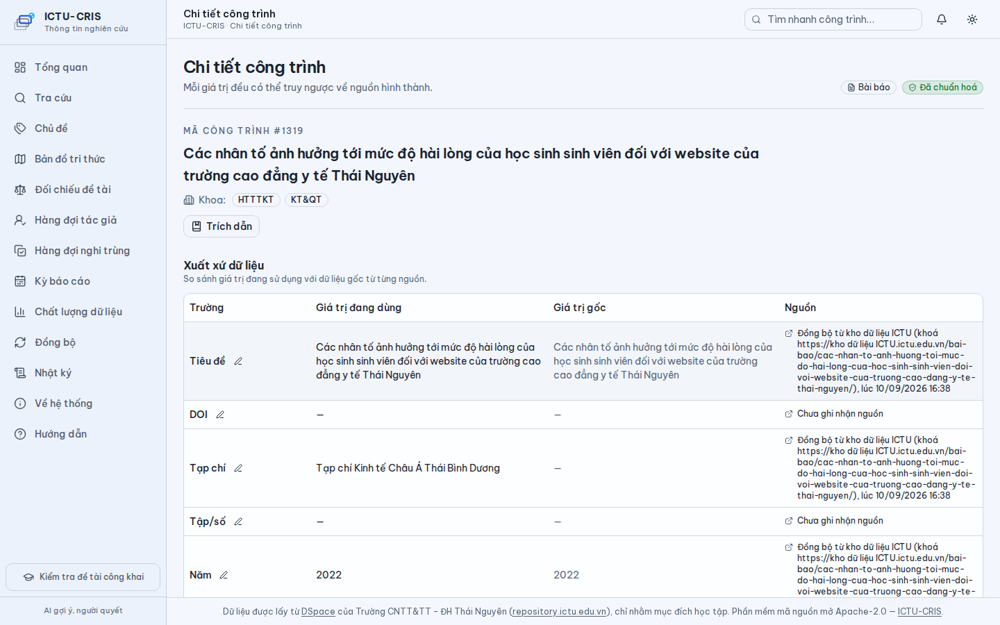

<div align="center">


# ICTU-CRIS

**Một nguồn sự thật cho dữ liệu công bố khoa học — mỗi con số truy ngược được về bản ghi gốc.**

*Hệ thống đồng bộ, chuẩn hoá và đối soát dữ liệu công bố khoa học cho Trường Công nghệ Thông tin và Truyền thông, Đại học Thái Nguyên.*

[](LICENSE)
[](https://github.com/maiychrus25/ICTU-CRIS/actions/workflows/ci.yml)
[](https://github.com/maiychrus25/ICTU-CRIS/releases)
[](https://github.com/maiychrus25/ICTU-CRIS/pkgs/container/ictu-cris)
[](pyproject.toml)

[](BUILDING.md)
[](CONTRIBUTING.md)


</div>

<p align="center"></p>

*Đường ống sáu bước: đồng bộ → chuẩn hoá → định danh tác giả → nối tác giả → gộp trùng → báo cáo chất lượng — mỗi bước ghi qua PostgreSQL, quyết định cuối luôn thuộc về người dùng. Tầng AI (đối chiếu đề tài, gợi ý hàng đợi, trục chủ đề) đọc từ các bảng của đường ống và chỉ ghi vào bảng `ai_*` của riêng nó — sơ đồ vẽ trước khi có tầng này, xem [docs/ai.md](docs/ai.md).*

Bản tương tác (pan/zoom, tra vết quan hệ, đổi sáng/tối): [docs/architecture/duong-ong-du-lieu.html](docs/architecture/duong-ong-du-lieu.html).

## 🌟 Tầm nhìn (Vision)

Dữ liệu công bố khoa học của một trường đại học hiện nằm rải rác ở ba nơi
không nói chuyện với nhau: Excel các khoa gửi qua email, kho công khai
`repository.ictu.edu.vn` (WordPress), và các chỉ mục ngoài (DOI, chỉ mục
trích dẫn). Không có cách nào truy ngược một con số trong báo cáo về bản ghi
gốc; mỗi lần điều chỉnh số liệu không để lại phiên bản nào.

ICTU-CRIS xây một nguồn sự thật duy nhất: mỗi bản ghi kéo về được giữ
nguyên bản và có phiên bản, mỗi trường dữ liệu sau chuẩn hoá nói được xuất
xứ của mình, và quyết định cuối cùng (nối tác giả, gộp bản ghi trùng) luôn
thuộc về con người, không phải máy. `CRIS` — *Current Research Information
System* — là tên gọi chuẩn quốc tế cho lớp hệ thống quản lý thông tin
nghiên cứu của một tổ chức: công trình, tác giả, đơn vị, kỳ báo cáo (chuẩn
CERIF, mạng euroCRIS). `ICTU-CRIS` là tên làm việc.

## 📊 Ba số liệu chi phối thiết kế (Three driving measurements)

Đo ngày 09–10/09/2026 trên 8.034 bản ghi và 410 hồ sơ giảng viên của kho
nguồn (xem [khao-sat-nguon/](khao-sat-nguon/README.md)):

| Số đo | Ảnh hưởng |
|---|---|
| Liên kết tác giả hiện phủ **8%** bài báo (155/1.907); chuẩn hoá tên đưa lên **86%** | Giai đoạn chuẩn hoá–đối soát là trung tâm hệ thống, không phải chức năng phụ |
| Kho **không có toàn văn** — 39/40 PDF là tóm tắt 1 trang do máy sinh | Đối chiếu đề tài chỉ ở mức tóm tắt, không dẫn chứng theo trang |
| **4.621/5.375** đồ án (86%) ghi giảng viên hướng dẫn là `ICTU_TEACHER` | Thống kê hướng dẫn đồ án chỉ đúng trên 14% kho cho tới khi nguồn được sửa |

## 🧭 Định vị theo HPDI (Human – Process – Data – Intelligence)

Khung phân tích H-P-D-I mượn từ bộ sách **DX-OS**
([opendigitransform.gitbook.io/dx-os](https://opendigitransform.gitbook.io/dx-os),
CC BY 4.0, tác giả TS. Tạ Tuấn Anh) — dự án chỉ trích dẫn khung tư duy này,
**không dùng bộ công cụ no-code của DX-OS**: lõi hệ thống là Python +
PostgreSQL, vì đối soát tác giả và truy xuất xứ từng trường dữ liệu cần một
mô hình quan hệ (relational model), không phải một chuỗi công cụ lắp ghép.

- **H (Human) — hiện trạng**: số liệu công bố khoa học hiện tổng hợp thủ
  công từ Excel các khoa gửi qua email, đối chiếu bằng mắt với kho, nhắc
  nộp bằng lời, chốt bằng bản ký sống — không có phiên bản khi điều chỉnh,
  không truy ngược được một con số về đâu ra.
- **P (Process) — ICTU-CRIS xây**: rào chắn kê khai và duyệt bằng quy tắc
  của hệ thống — lý do trả lại bắt buộc khi từ chối, phiên bản báo cáo được
  đóng băng sau khi chốt, không sửa ngầm sau khi đã ký.
- **D (Data) — ICTU-CRIS xây**: một nguồn sự thật duy nhất (`source_record`),
  xuất xứ của từng trường dữ liệu (`field_provenance`), phiên bản của mỗi
  báo cáo, và khả năng truy ngược mọi con số về bản ghi gốc.
- **I (Intelligence) — một phần, luôn có người quyết**: hệ thống gợi ý nối
  tác giả và đối chiếu đề tài, nhưng quyết định cuối luôn thuộc về người
  dùng — quy tắc BR-18 ("AI gợi ý, người quyết", xem
  [docs/ba/15-project-rules.md](docs/ba/15-project-rules.md)).

## 🏗️ Kiến trúc & Ngăn xếp công nghệ (Architecture & Tech stack)

Gói `cris` gồm ba tầng tách bạch. **Tầng nghiệp vụ** là đường ống: **đồng bộ**
(`sync`) → **chuẩn hoá** (`normalize`) → **nối và gộp tác giả** (`people`, `link`,
`dedup`) → **báo cáo chất lượng** (`quality`), cộng lược đồ kỳ báo cáo (`period`).
**Tầng API** (`cris/api/`, FastAPI, router `/api/*`, OpenAPI tại `/docs`) chỉ gọi
vào tầng nghiệp vụ. **Giao diện** là bản xuất tĩnh Next.js (`frontend/`) — dựng
sẵn thành HTML/CSS/JS tĩnh (`next build`, `output: "export"`), FastAPI phục vụ
bản xuất đó ở `/` cùng gốc với `/api/*`: **một ảnh Docker, một container, một
cổng** cho cả API lẫn giao diện. **Tầng AI** (`cris/ai/`) cũng chỉ gọi vào tầng
nghiệp vụ và chỉ ghi vào bảng `ai_*`. Lược đồ CSDL nằm ở `cris/migrations/0001`–
`0010` (PostgreSQL 16, không ORM).

| Thành phần | Công nghệ | Vai trò |
|---|---|---|
| Lõi xử lý | Python 3.12, chỉ stdlib + `psycopg` 3 | Không ORM — truy vấn SQL trực tiếp |
| CSDL | PostgreSQL 16 | Migration SQL thuần `0001`–`0010` |
| Đóng gói | sdist + wheel đính kèm mỗi Release (không gồm `frontend/`); ảnh `ghcr.io/maiychrus25/ictu-cris` là bản chạy đủ (`:<version>-ai` kèm thư viện AI) | Workflow `release.yml` kiểm phiên bản khớp tag; `docker.yml` đẩy ảnh theo semver |
| Triển khai | `deploy/setup.sh` + `deploy/docker-compose.yml` | Một lệnh: DB, lược đồ, người dùng mặc định, giao diện; `--ai` tải mô hình |
| API | FastAPI + `uvicorn` | Router `/api/*`, tài liệu OpenAPI tương tác ở `/docs` |
| Giao diện | Next.js (App Router, TypeScript, Tailwind, shadcn/ui), xuất tĩnh (`next export`) | Gọi `/api/*` cùng gốc khi chạy sau FastAPI; dev chạy cổng riêng gọi API qua `NEXT_PUBLIC_API_BASE` |
| AI | Extra tuỳ chọn `[ai]`: `onnxruntime` · `tokenizers` · `numpy` | Mô hình `paraphrase-multilingual-MiniLM-L12-v2` ONNX 118 MB chạy CPU; `CRIS_AI_PROVIDER=none` vẫn chạy đủ chức năng |
| Kiểm thử | pytest 8 trên PostgreSQL thật (backend) + Playwright (giao diện) | Không mock cơ sở dữ liệu; xem BUILDING.md §9 cho số test hiện tại |
| CI | GitHub Actions | lint (ruff), test Python 3.12 + 3.13 trên PostgreSQL 16, giao diện (lint/kiểu/build/e2e), `pip-audit`, dựng gói + ảnh đa tầng; PR check, auto-label, Dependabot |
| Quy tắc | Bảng `rule_set` có phiên bản | Chuẩn hoá tên, ánh xạ loại bài, khoá gộp |

CLI thống nhất:

```
python -m cris migrate|seed|sync [paths]|people|normalize|link|dedup|quality [--json]
python -m cris serve [--host] [--port]
python -m cris ai download|embed|topics|suggest|screen|status      # cần CRIS_AI_PROVIDER=local
python -m cris user set-password <email>|list                     # đăng nhập cục bộ (NFR-01)
python -m cris user create --email --name --roles a,b [--unit CODE] [--password]
python -m cris user set-unit --email --unit CODE
python -m cris user create-lecturers [--unit CODE] [--dry-run]     # tài khoản lecturer (H3)
```

## ✨ Tính năng (Features)

- **Đăng nhập & vai trò** — mật khẩu cục bộ băm PBKDF2, phiên cookie; **chế độ
  mở** giữ nguyên tới khi có người đặt mật khẩu bằng `python -m cris user
  set-password`, khi đó `rd_officer` mới được quyết định.
- **Chủ đề** (`/chu-de/`) — 40 cụm AI theo từ khoá, xem chi tiết từng cụm và
  tra cứu công trình theo cụm (drill-down).
- **Đồng bộ** (`/dong-bo/`) — lịch sử các lượt đồng bộ: thêm/đổi/mất.
- **Kê khai vào kỳ báo cáo — duyệt hai cấp theo BA** — hồ sơ đi qua Nháp →
  Chờ khoa duyệt → Khoa đã duyệt → Chờ phòng kiểm tra → Đạt yêu cầu → Đã
  chốt, mỗi cấp có thể trả hồ sơ về Nháp kèm lý do bắt buộc; vai trò cấp
  khoa chỉ thấy và thao tác được hồ sơ của đơn vị mình (NFR-02, lọc ở tầng
  SQL); giảng viên tự kê khai công trình của chính mình và trình khoa duyệt
  (`/ke-khai-cua-toi/`).
- **Chỉnh tay có xuất xứ** (BR-23) — phòng KH-CN sửa trực tiếp 9 trường của
  một công trình (tiêu đề, DOI, năm/số, tạp chí, tập, loại bài, khoá, tóm
  tắt, từ khoá) khi nguồn sai hoặc thiếu, luôn kèm lý do bắt buộc; **không**
  sửa được tác giả, đơn vị, minh chứng. Mỗi lần sửa ghi `field_provenance`
  (`set_kind='manual'`) — dòng "Nguồn" đổi thành "Chỉnh tay bởi … lúc …",
  truy ngược được ai sửa và giá trị cũ.
- **Tra cứu & hồ sơ** — tìm công trình theo từ khoá/loại/năm/đơn vị/chủ đề
  (gõ không dấu vẫn ra kết quả đúng), chi tiết có xuất xứ từng trường, hồ sơ
  công bố giảng viên.
- **Hàng đợi người quyết** — xác nhận liên kết tác giả, gộp/giữ riêng nghi
  trùng, luôn có gợi ý AI kèm lý do, quyết định cuối luôn thuộc về người dùng.
- **Tổng quan cho lãnh đạo** (`/tong-quan/`) — công trình theo năm × loại, theo
  đơn vị, top giảng viên, tỉ lệ đã liên kết tác giả, hàng đợi đang mở.
- **Xuất CSV** — danh sách công trình đã lọc và hồ sơ công bố giảng viên, UTF-8
  có BOM, tải thẳng từ trình duyệt.
- **Nhật ký thao tác** (`/nhat-ky/`) — mọi quyết định (xác nhận/bác bỏ liên kết,
  gộp/giữ riêng, mở/đóng/huỷ kỳ báo cáo) đọc lại được kèm người thực hiện.
- **Kỳ báo cáo** (`/ky-bao-cao/`) — mở, đóng, huỷ kỳ và xem tiến độ kê khai
  theo đơn vị.
- **Rà soát trùng đề tài theo khoá** (`/doi-chieu/ra-soat/`) — so đề tài đồ án
  của một khoá với toàn bộ khoá trước, gắn cờ theo mức "cao/vừa/thấp"; ngưỡng
  hiệu chuẩn 0,90/0,80 trên phân bố điểm thật (47/529 đồ án khoá 21 được gắn
  cờ). AI chỉ gợi ý, người quyết đi tiếp ở `/doi-chieu/`.
- **Chất lượng dữ liệu** (`/chat-luong-du-lieu/`) — báo cáo độ phủ liên kết,
  cảnh báo dữ liệu thiếu/nghi vấn.

### Màn hình (Screenshots)

Chụp trên dữ liệu thật đồng bộ từ `repository.ictu.edu.vn` (11/09/2026).

| Tổng quan cho lãnh đạo | Đối chiếu đề tài (4 khía cạnh) |
|---|---|
|  |  |

| Rà soát trùng đề tài theo khoá | Hàng đợi liên kết tác giả |
|---|---|
|  |  |

| Nghi trùng — so cạnh nhau | Chi tiết công trình — xuất xứ từng trường |
|---|---|
|  |  |

## 🚀 Cài đặt nhanh (Quick start)

```bash
cp .env.example .env
docker compose up -d db
docker compose build app
docker compose run --rm app migrate
```

Chạy đường ống:

```bash
docker compose run --rm app seed
docker compose run --rm app sync bai-bao giang-vien
docker compose run --rm app people
docker compose run --rm app normalize
docker compose run --rm app link
docker compose run --rm app dedup
docker compose run --rm app quality --json
```

Mỗi yêu cầu tới kho nguồn được giãn cách **0,35 giây**; một lần đồng bộ đầy
đủ toàn bộ kho (6 loại, đọc cả trang chi tiết) đo ngày 10/09/2026 mất khoảng
**2 giờ**. Xem [BUILDING.md](BUILDING.md) để chạy không dùng Docker (venv +
`pip install -e ".[dev]"`).

Giao diện web và AI (venv, xem BUILDING.md §6–7):

```bash
pip install -e ".[ai]" && python -m cris ai download   # một lần, 135 MB
export CRIS_AI_PROVIDER=local
python -m cris ai embed && python -m cris ai topics && python -m cris ai suggest
python -m cris ai screen --cohort K18                   # rà soát trùng đề tài đồ án khoá K18
python -m cris serve                                    # http://127.0.0.1:8000
```

Cần ít nhất một người dùng vai `rd_officer` trong `app_user`; chưa có thì trang trả
`503` kèm câu SQL để tạo. Bản này chưa có đăng nhập thật — **không triển khai lên
mạng công khai**.

## 📌 Trạng thái & Lộ trình (Status & Roadmap)

- [x] Khảo sát kho nguồn và bộ BA 18 tệp
- [x] Mô hình dữ liệu 0.1
- [x] Lát cắt S + N chạy từ dòng lệnh, 209 test
- [x] Hồ sơ nguồn mở
- [ ] Nhập Excel khoa (S-06)
- [x] Giao diện hàng đợi xác nhận và tra cứu
- [x] Quét bù phân trang (S-04)
- [x] Tích hợp AI: đối chiếu đề tài, gợi ý hàng đợi, trục chủ đề — mô hình cục bộ, không cần khoá API ([docs/ai.md](docs/ai.md))
- [x] **0.2.0 đã phát hành (11/09)** — API JSON, giao diện Next.js, kỳ báo cáo, rà
      soát trùng đề tài theo khoá
- [x] **0.3.0 đã phát hành (11/09)** — đăng nhập cục bộ và vai trò, tìm người,
      chủ đề, lịch sử đồng bộ, kê khai công trình vào kỳ
- [ ] **0.4.0 đang phát triển (lát cắt H)** — duyệt hai cấp đúng theo BA
      (`docs/ba/03-state.md`), phạm vi đơn vị (NFR-02), chỉnh tay có xuất xứ
      (BR-23), tìm kiếm không dấu, giảng viên tự kê khai công trình của mình
      (xem [docs/release-notes/v0.4.0.md](docs/release-notes/v0.4.0.md), dự
      thảo)
- [ ] Còn lại: SSO trường thật, biểu mẫu Bộ, đính kèm tệp minh chứng (hiện
      chỉ URL/ghi chú)

## 📚 Tài liệu (Documentation)

| | Tài liệu | Nội dung |
|---|---|---|
| 🎯 | [docs/BRD.md](docs/BRD.md) | Yêu cầu nghiệp vụ: 6 vấn đề đo được, YN-01..10, ràng buộc cuộc thi |
| 📐 | [docs/SRS.md](docs/SRS.md) | Đặc tả phần mềm: FR theo giai đoạn, tích hợp AI, ma trận truy vết YN → FR → UC → US |
| 🤖 | [docs/ai.md](docs/ai.md) | AI làm gì và không làm gì, ba nhà cung cấp, mô hình, thuật toán, giới hạn |
| 🏷️ | [docs/release-notes/v0.3.0.md](docs/release-notes/v0.3.0.md) | Ghi chú phát hành bản hiện tại (cũ hơn: [v0.2.0](docs/release-notes/v0.2.0.md), [v0.1.0](docs/release-notes/v0.1.0.md)) |
| 📋 | [docs/ba/00-README.md](docs/ba/00-README.md) | Bộ tài liệu phân tích nghiệp vụ (BA) — 18 tệp |
| 🗄️ | [docs/ba/17-mo-hinh-du-lieu.md](docs/ba/17-mo-hinh-du-lieu.md) | Mô hình dữ liệu bản 0.1 cho lát cắt S + N + T-01/T-02 |
| 🗺️ | [docs/superpowers/plans/](docs/superpowers/plans/) | Kế hoạch triển khai từng lát cắt: S + N, hồ sơ nguồn mở, giao diện hàng đợi, K, AI |
| 🔧 | [BUILDING.md](BUILDING.md) | Dịch và chạy từ mã nguồn (Docker, venv) |
| 📚 | [DEPENDENCIES.md](DEPENDENCIES.md) | Chính sách và danh mục thư viện |
| ⚖️ | [docs/LICENSE_NOTICE.md](docs/LICENSE_NOTICE.md) | Lý do chọn giấy phép, ma trận tương thích, quy định header |
| 📝 | [CHANGELOG.md](CHANGELOG.md) | Lịch sử thay đổi |
| 🔍 | [khao-sat-nguon/](khao-sat-nguon/README.md) | Khảo sát kho nguồn `repository.ictu.edu.vn` + công cụ trích xuất |
| 🎓 | [docs/KH triển khai ĐATN_DHCQ_K21.docx](docs/KH%20triển%20khai%20ĐATN_DHCQ_K21.docx) | Kế hoạch đồ án tốt nghiệp của Khoa CNTT (đầu vào nghiệp vụ cho luồng đối chiếu đề tài; không phải lịch của dự án) |

## 🐛 Quản lý lỗi & Đóng góp (Bug tracker & Contributing)

Báo lỗi hoặc đề xuất tính năng qua
[GitHub Issues](https://github.com/maiychrus25/ICTU-CRIS/issues), dùng mẫu
trong [.github/ISSUE_TEMPLATE/](.github/ISSUE_TEMPLATE/). Xem
[CONTRIBUTING.md](CONTRIBUTING.md) cho quy trình, chuẩn mã và
[Conventional Commits](https://www.conventionalcommits.org/) cho thông điệp
commit. Quy tắc ứng xử ở [CODE_OF_CONDUCT.md](CODE_OF_CONDUCT.md).

## 🔒 Dữ liệu & Quyền riêng tư (Data & Privacy)

Kho mã nguồn chỉ chứa fixture kiểm thử đã ẩn danh thông tin cá nhân giảng
viên (tên, email, điện thoại, ngày sinh); tên tác giả trên fixture bài báo
là dữ liệu thư mục công khai (bibliographic data). Dữ liệu cá nhân thật
(số điện thoại, ngày sinh giảng viên, ...) không bao giờ được đưa vào Git —
đây là các cột bị hạn chế truy cập.

## 📜 Giấy phép (License)

Apache-2.0 — xem [LICENSE](LICENSE), [NOTICE](NOTICE) và
[docs/LICENSE_NOTICE.md](docs/LICENSE_NOTICE.md). Bản quyền: ICTU-CRIS
contributors.
