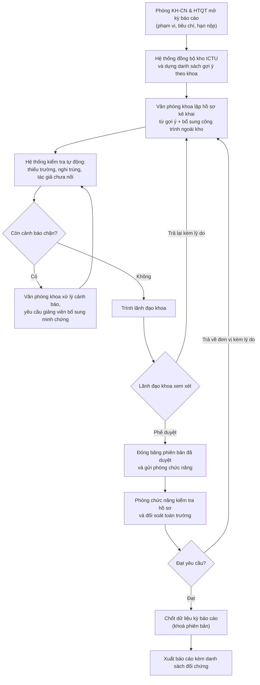
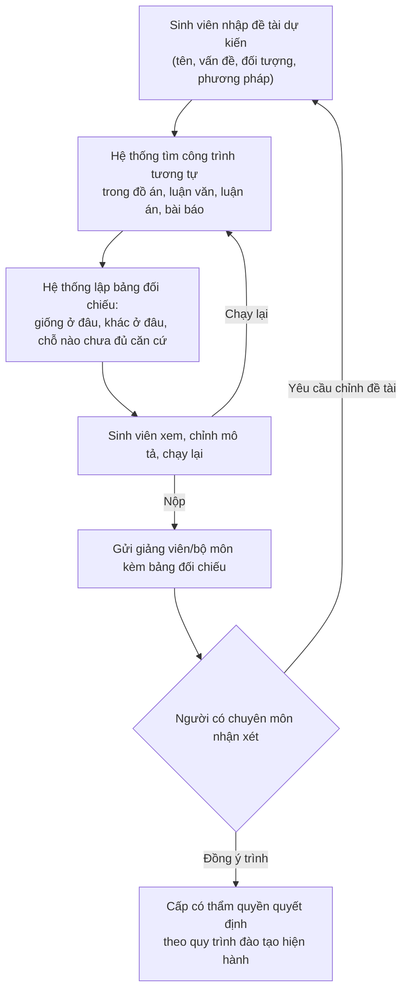

# 1. Sơ đồ BPMN — ICTU-CRIS

## 1.1 Kỳ báo cáo công bố khoa học (quy trình lõi)

Ba điểm khác so với luồng trong tài liệu định hướng:

1. Thêm bước **B (đồng bộ kho)** trước khi khoa lập hồ sơ. Đây là chỗ giải quyết vấn đề *"có nhập lại thông tin đã nằm trong kho không"* — khoa bắt đầu từ danh sách gợi ý, không từ trang trắng.
2. **D là vòng lặp có điều kiện**, không phải một bước thẳng. Hồ sơ chỉ được trình khi hết cảnh báo chặn; cảnh báo cảnh cáo thì cho qua kèm ghi chú.
3. **I là bước đóng băng phiên bản**, tách khỏi hành động phê duyệt. Điều này thực hiện yêu cầu *"sau khi duyệt, phiên bản đó phải được giữ nguyên"*.

## 1.2 Đối chiếu đề tài dự kiến (quy trình phụ, độc lập)

Theo khuyến nghị tách luồng riêng trong tài liệu phân tích quy trình. Luồng này **không** đi qua Phòng KH-CN & HTQT.

Ràng buộc: đầu ra của bước C là **báo cáo hỗ trợ xem xét**, không phải quyết định "được làm / không được làm". Hệ thống không kết luận đạo văn và không khẳng định tính mới.
