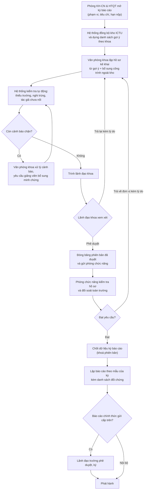
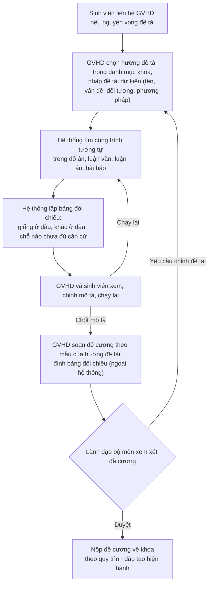

# 1. Sơ đồ BPMN — ICTU-CRIS

## 1.1 Kỳ báo cáo công bố khoa học (quy trình lõi)

Bốn điểm khác so với luồng trong tài liệu định hướng:

1. Thêm bước **B (đồng bộ kho)** trước khi khoa lập hồ sơ. Đây là chỗ giải quyết vấn đề *"có nhập lại thông tin đã nằm trong kho không"* — khoa bắt đầu từ danh sách gợi ý, không từ trang trắng. Khảo sát đợt 1 cho biết kho chỉ là nguồn tham chiếu; nguồn chính hiện là Excel các khoa gửi, nên bước C phải nhận cả nhập tệp.
2. **D là vòng lặp có điều kiện**, không phải một bước thẳng. Hồ sơ chỉ được trình khi hết cảnh báo chặn; cảnh báo cảnh cáo thì cho qua kèm ghi chú.
3. **I là bước đóng băng phiên bản**, tách khỏi hành động phê duyệt. Điều này thực hiện yêu cầu *"sau khi duyệt, phiên bản đó phải được giữ nguyên"*.
4. **N–O là cấp lãnh đạo trường**, bổ sung theo khảo sát đợt 1: phòng chốt số liệu nghiệp vụ, báo cáo chính thức gửi ĐHTN hoặc cấp trên còn phải lãnh đạo trường ký (BR-24). Báo cáo nội bộ không qua bước này.

## 1.2 Đối chiếu đề tài dự kiến (quy trình phụ, độc lập)

Theo khuyến nghị tách luồng riêng trong tài liệu phân tích quy trình. Luồng này **không** đi qua Phòng KH-CN & HTQT. Trình tự bám theo kế hoạch triển khai ĐATN của Khoa CNTT (mốc 1–3): sinh viên liên hệ GVHD, GVHD chọn hướng đề tài và soạn đề cương, lãnh đạo bộ môn duyệt.

Ràng buộc: đầu ra của bước D là **báo cáo hỗ trợ xem xét**, không phải quyết định "được làm / không được làm". Hệ thống không kết luận đạo văn và không khẳng định tính mới.

Hai mốc thời gian tách biệt trong kế hoạch ĐATN: đối chiếu đề tài phải xong **trước hạn nộp đề cương** (mốc 2, đầu kỳ); kiểm tra đạo văn diễn ra **cuối kỳ** trên quyển báo cáo (mốc 5) bằng công cụ riêng của khoa. Hệ thống chỉ phục vụ mốc đầu, không thay thế mốc sau.
