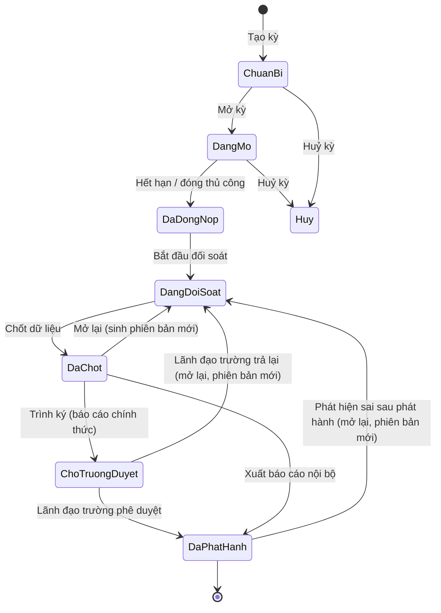
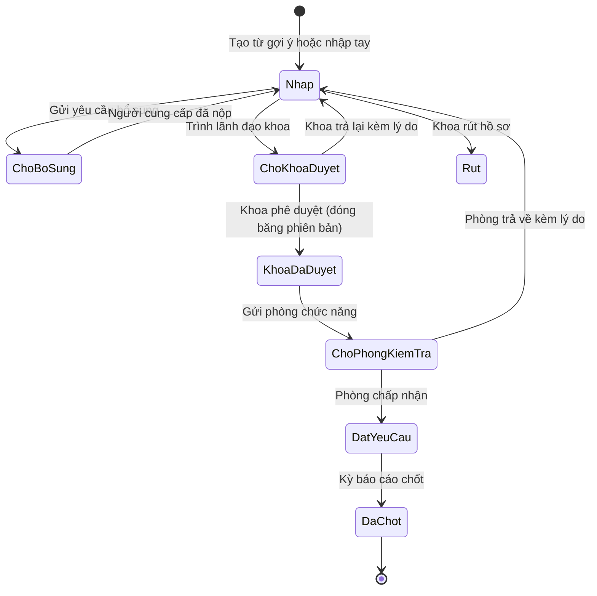
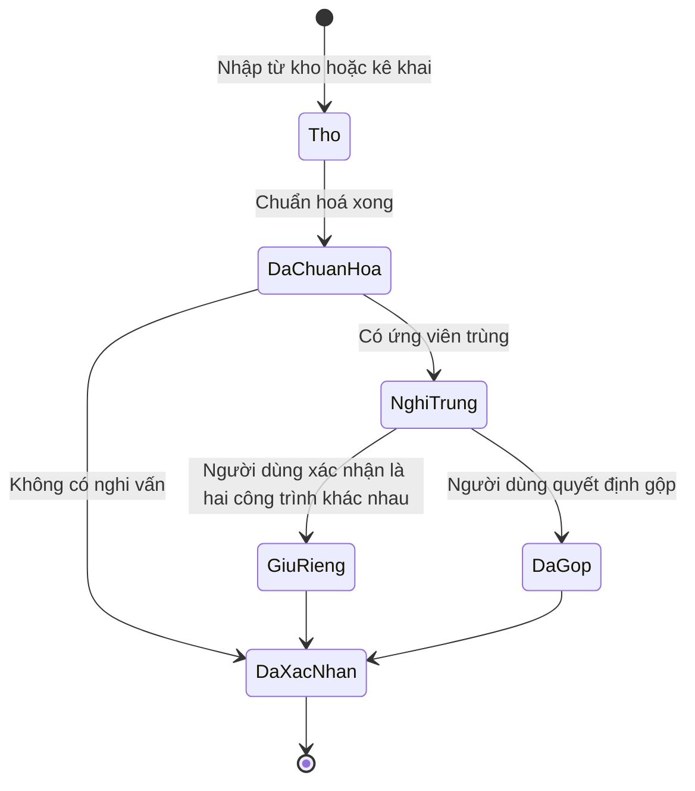
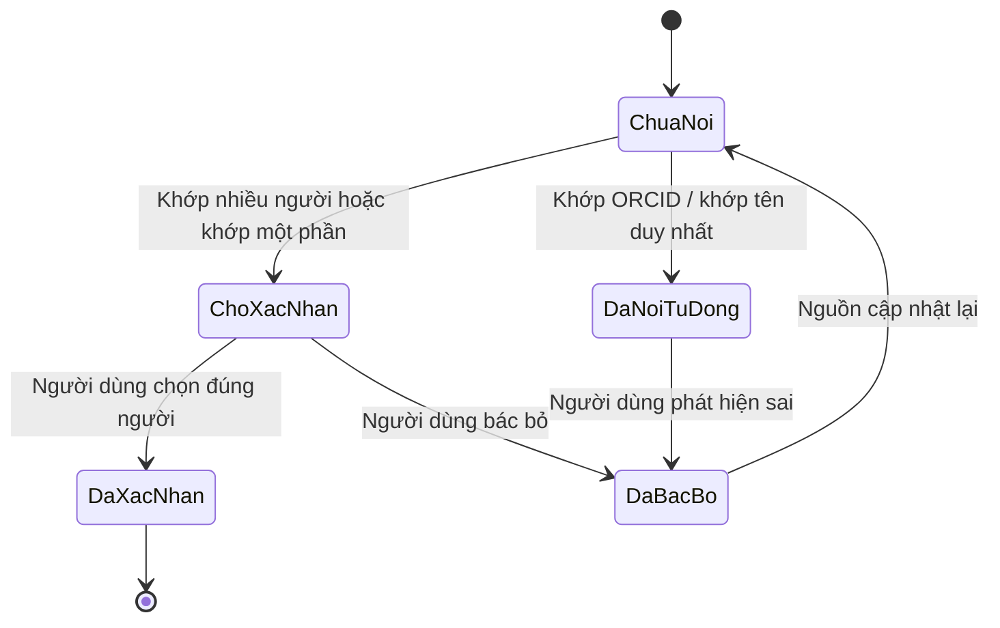
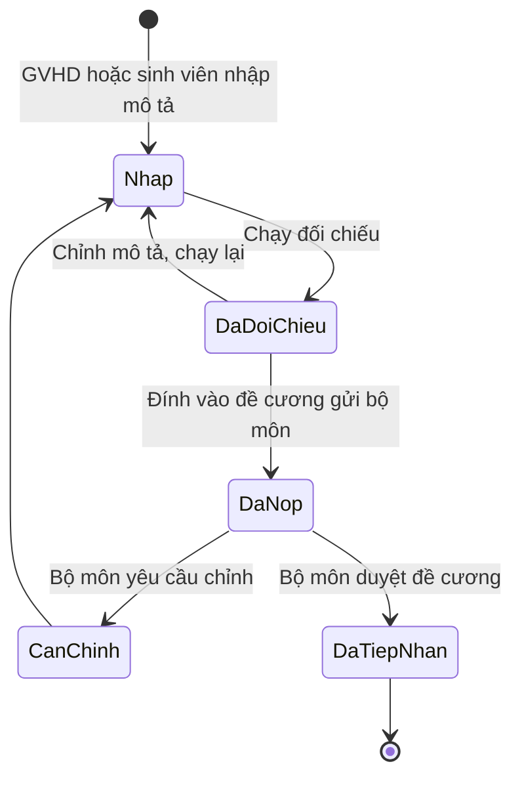

# 3. Biểu đồ trạng thái — ICTU-CRIS

## 3.1 Kỳ báo cáo (Period)

Quy tắc: sau `DaChot`, số liệu không đổi. Mọi điều chỉnh phải qua `Mở lại`, và sinh **phiên bản báo cáo mới**, giữ nguyên phiên bản cũ — thực hiện yêu cầu *"điều chỉnh bằng phiên bản mới"*. Mỗi phiên bản mới ghi: số cũ, số mới, lý do đổi, và danh sách báo cáo đã dùng phiên bản cũ (BR-25). Trạng thái `ChoTruongDuyet` chỉ áp dụng cho báo cáo chính thức gửi cấp trên (BR-24).

## 3.2 Hồ sơ kê khai (Declaration)

Quy tắc trọng yếu: từ `KhoaDaDuyet` trở đi, mọi thay đổi danh sách công trình hoặc số liệu trọng yếu đưa hồ sơ về `Nhap` và **huỷ dấu đã duyệt**. Không giữ dấu "đã duyệt" cho nội dung đã khác.

## 3.3 Công trình (Work)

## 3.4 Liên kết tác giả (AuthorLink)

Độ tin cậy gắn vào liên kết: `orcid` > `ten_day_du_duy_nhat` > `ten_day_du_nhieu_ung_vien` > `ten_mot_phan`. Chỉ hai mức đầu được tự nối.

## 3.5 Đề tài dự kiến (Proposal — luồng đối chiếu)

Hệ thống dừng ở `DaTiepNhan`. Việc duyệt đề cương, nộp về khoa và các mốc sau của kế hoạch ĐATN thuộc quy trình đào tạo, ngoài phạm vi.
