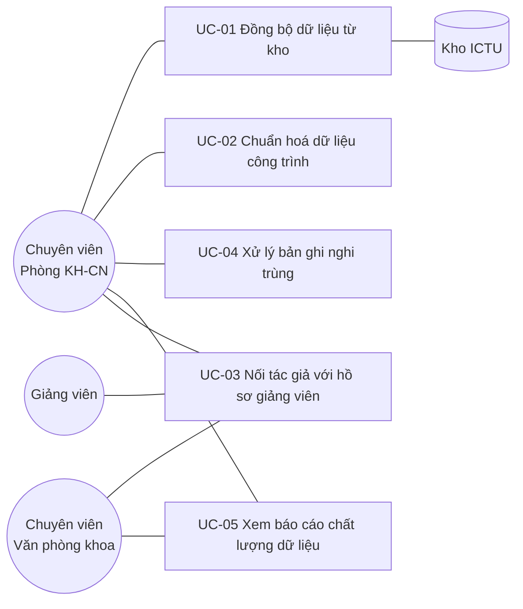
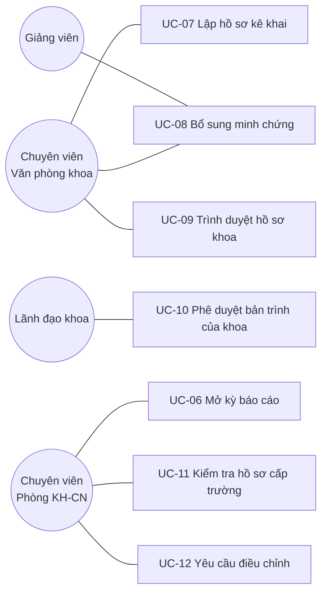
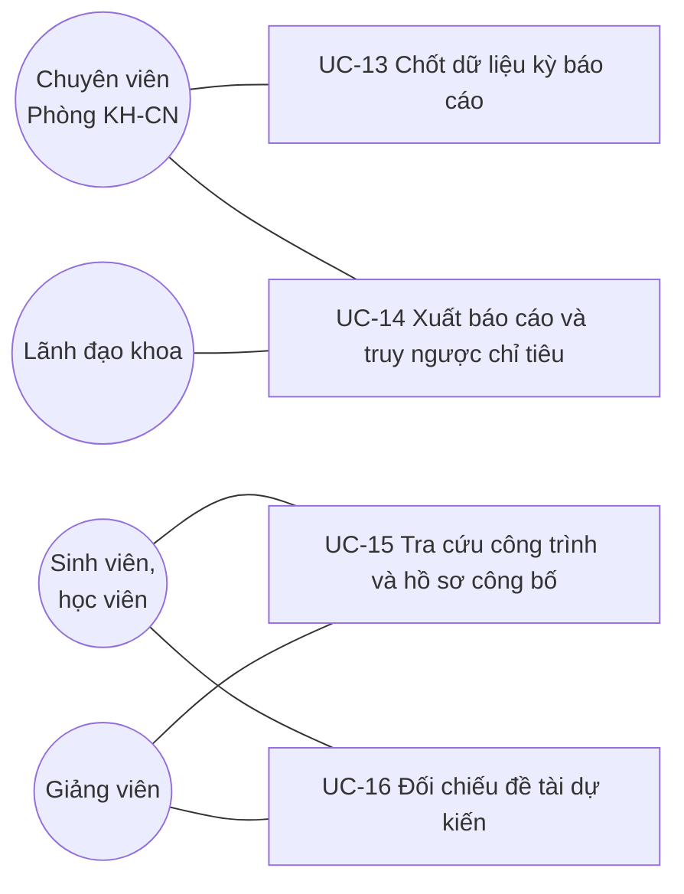

# 9. Sơ đồ use case — ICTU-CRIS

## 9.1 Đồng bộ, chuẩn hoá và đối soát

```mermaid
flowchart LR
    RD(("Chuyên viên<br/>Phòng KH-CN"))
    FO(("Chuyên viên<br/>Văn phòng khoa"))
    LEC(("Giảng viên"))
    REPO[("Kho ICTU")]

    UC01["UC-01 Đồng bộ dữ liệu từ kho"]
    UC02["UC-02 Chuẩn hoá dữ liệu công trình"]
    UC03["UC-03 Nối tác giả với hồ sơ giảng viên"]
    UC04["UC-04 Xử lý bản ghi nghi trùng"]
    UC05["UC-05 Xem báo cáo chất lượng dữ liệu"]

    RD --- UC01
    RD --- UC02
    RD --- UC04
    RD --- UC05
    RD --- UC03
    FO --- UC03
    LEC --- UC03
    FO --- UC05
    UC01 --- REPO
```

## 9.2 Kê khai và phê duyệt

```mermaid
flowchart LR
    FO(("Chuyên viên<br/>Văn phòng khoa"))
    FH(("Lãnh đạo khoa"))
    LEC(("Giảng viên"))
    RD(("Chuyên viên<br/>Phòng KH-CN"))

    UC06["UC-06 Mở kỳ báo cáo"]
    UC07["UC-07 Lập hồ sơ kê khai"]
    UC08["UC-08 Bổ sung minh chứng"]
    UC09["UC-09 Trình duyệt hồ sơ khoa"]
    UC10["UC-10 Phê duyệt bản trình của khoa"]
    UC11["UC-11 Kiểm tra hồ sơ cấp trường"]
    UC12["UC-12 Yêu cầu điều chỉnh"]

    RD --- UC06
    FO --- UC07
    LEC --- UC08
    FO --- UC08
    FO --- UC09
    FH --- UC10
    RD --- UC11
    RD --- UC12
```

## 9.3 Chốt, báo cáo, tra cứu và đối chiếu

```mermaid
flowchart LR
    RD(("Chuyên viên<br/>Phòng KH-CN"))
    FH(("Lãnh đạo khoa"))
    ST(("Sinh viên,<br/>học viên"))
    LEC(("Giảng viên"))

    UC13["UC-13 Chốt dữ liệu kỳ báo cáo"]
    UC14["UC-14 Xuất báo cáo và truy ngược chỉ tiêu"]
    UC15["UC-15 Tra cứu công trình và hồ sơ công bố"]
    UC16["UC-16 Đối chiếu đề tài dự kiến"]

    RD --- UC13
    RD --- UC14
    FH --- UC14
    ST --- UC15
    ST --- UC16
    LEC --- UC15
    LEC --- UC16
```
