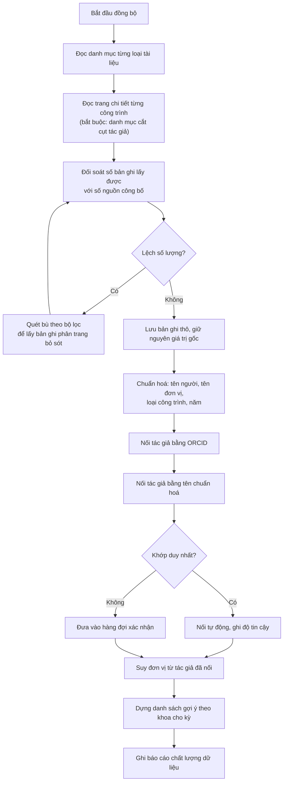
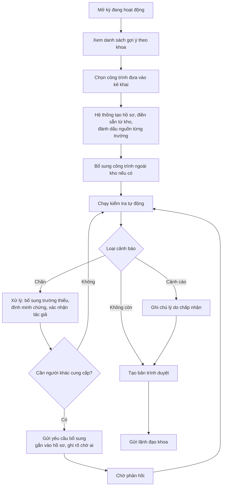
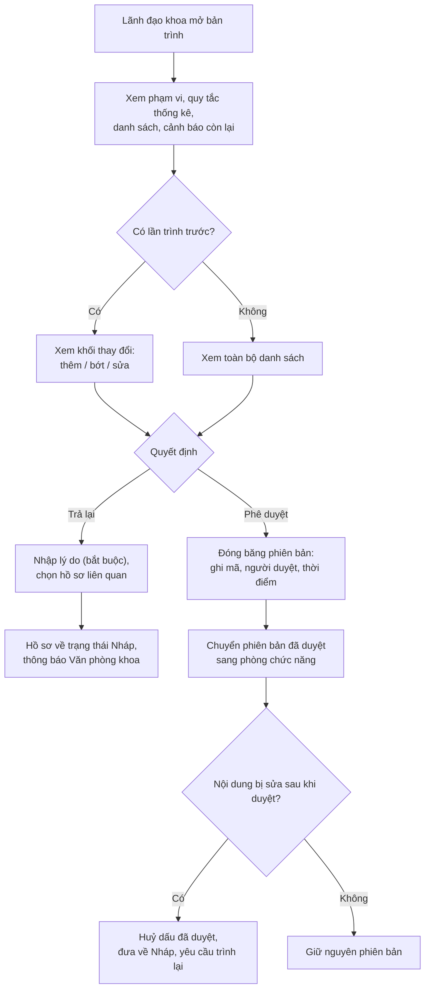
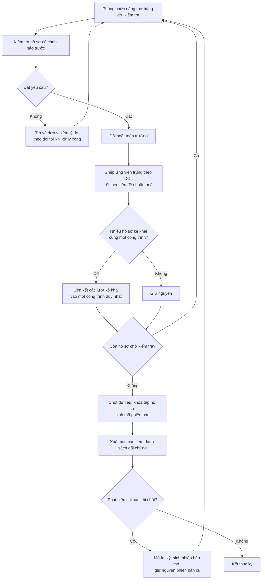

# 10. Sơ đồ luồng chức năng (activity) — ICTU-CRIS

## 10.1 Đồng bộ kho và dựng gợi ý theo khoa (UC-01, UC-03)

Điểm quyết định `E` là bắt buộc, không phải tuỳ chọn: nguồn hiện có lỗi phân trang khiến duyệt tuần tự bỏ sót bản ghi mà **không báo lỗi**. Không đối soát số lượng thì mất dữ liệu âm thầm.

## 10.2 Lập hồ sơ và xử lý cảnh báo (UC-07)

## 10.3 Phê duyệt và bảo toàn phiên bản (UC-10)

Nhánh `K → L` thực hiện nguyên tắc trong tài liệu định hướng: *"không được giữ dấu đã duyệt cho một nội dung đã khác"*.

## 10.4 Đối soát cấp trường và chốt dữ liệu (UC-11, UC-13)

