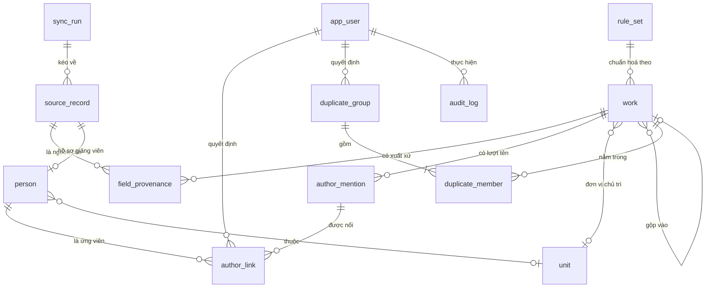

# 17. Mô hình dữ liệu — ICTU-CRIS, bản 0.1 cho lát cắt S + N + T-01/T-02

Phạm vi: đồng bộ (S), chuẩn hoá và đối soát (N), tra cứu công trình và hồ sơ giảng viên (T-01, T-02). Không có kỳ báo cáo, hồ sơ kê khai, bản trình, phiên bản báo cáo; ba điểm móc cho các phần đó ghi ở §17.7.

Quy ước: tên bảng và cột dạng `snake_case`, tiếng Anh, trùng với khoá đang dùng trong [khao-sat-nguon/harvest.py](../../khao-sat-nguon/harvest.py). Kiểu dữ liệu theo PostgreSQL. Cột **Bắt buộc**: `C` có, `K` không.

## 17.1 Ba nguyên tắc

| # | Nguyên tắc | Thực hiện | Nguồn |
|---|---|---|---|
| 1 | Không ghi đè giá trị gốc | Bản ghi kéo về giữ nguyên JSON trong `source_record`, tách khỏi `work` | BR-06, S-07 |
| 2 | Mỗi trường nói được nguồn của mình | `field_provenance` ghi từng trường: giá trị gốc, bản ghi nguồn, ai đặt, lúc nào | NFR-24, BR-25 |
| 3 | Nhật ký chỉ thêm | `audit_log` không cấp quyền UPDATE, DELETE cho vai trò ứng dụng | NFR-04 |

## 17.2 Sơ đồ quan hệ

`catalog` không có khoá ngoại vào các bảng khác; các cột mã (`doc_type`, `venue_kind`, `indexes`, `direction_code`) tham chiếu `catalog.code` theo `kind` và được kiểm ở tầng ứng dụng. Ràng buộc khoá ngoại thật cho danh mục là nâng cấp khi danh mục đã đóng (Q-10, Q-21).

## 17.3 Bảng dữ liệu

### `sync_run` — một lần đồng bộ hoặc nhập tệp (S-01, S-03, S-05, S-06)

| STT | Cột | Kiểu | Bắt buộc | Khởi tạo | Ràng buộc, ghi chú |
|---|---|---|---|---|---|
| 1 | `id` | bigserial | C | tự tăng | Khoá chính |
| 2 | `source` | text | C | | `repository` · `excel_faculty` · `sheet_registration` · `manual` |
| 3 | `scope` | text | C | | Loại tài liệu hoặc tên tệp |
| 4 | `started_at` | timestamptz | C | now() | |
| 5 | `finished_at` | timestamptz | K | | |
| 6 | `expected_count` | jsonb | K | | Số nguồn công bố theo loại, ví dụ `{"do-an":5375}` |
| 7 | `fetched_count` | jsonb | K | | Số lấy được theo loại |
| 8 | `added` / `changed` / `vanished` | int | C | 0 | Ghi nhận thay đổi giữa hai lần (S-05) |
| 9 | `errors` | jsonb | K | `[]` | Trang chi tiết lỗi, tệp lỗi dòng |
| 10 | `warnings` | jsonb | K | `[]` | Lệch số lượng sau khi quét bù (S-04) |
| 11 | `status` | text | C | `running` | `running` · `ok` · `warning` · `failed` |
| 12 | `triggered_by` | bigint → `app_user.id` | K | | Null khi chạy theo lịch |

### `source_record` — bản ghi thô, bất biến (S-07, PR-05)

| STT | Cột | Kiểu | Bắt buộc | Khởi tạo | Ràng buộc, ghi chú |
|---|---|---|---|---|---|
| 1 | `id` | bigserial | C | | Khoá chính |
| 2 | `sync_run_id` | bigint → `sync_run.id` | C | | Lần đầu thấy phiên bản này |
| 3 | `source` | text | C | | Như `sync_run.source` |
| 4 | `source_key` | text | C | | URL trang chi tiết; với tệp: `tên_tệp#hash_tệp#dòng` |
| 5 | `doc_type` | text | C | | `bai_bao` · `do_an` · `luan_van` · `luan_an` · `giang_vien` · `hoc_lieu` · `dang_ky_do_an` |
| 6 | `version` | int | C | 1 | Tăng khi nội dung đổi |
| 7 | `content_hash` | text | C | | sha256 của `raw` |
| 8 | `raw` | jsonb | C | | JSON đúng như parser trả về, không sửa |
| 9 | `first_seen_at` | timestamptz | C | now() | |
| 10 | `last_seen_at` | timestamptz | C | now() | Cột duy nhất được cập nhật |
| 11 | `status` | text | C | `active` | `active` · `vanished`; biến mất ở nguồn thì đánh dấu, không xoá |

Duy nhất: `(source, source_key, version)`. Chỉ số: `(source, source_key)`. Không ràng buộc duy nhất theo `content_hash`: nội dung có thể quay về băm của một phiên bản cũ (ví dụ trang chi tiết lỗi tạm thời rồi phục hồi) và khi đó vẫn là một phiên bản mới so với phiên bản gần nhất. Nhiều phiên bản của cùng khoá có thể cùng `status = active`; người đọc luôn lấy `max(version)`.

### `work` — công trình sau chuẩn hoá (N-01, N-07..N-13, N-16, N-17)

| STT | Cột | Kiểu | Bắt buộc | Khởi tạo | Ràng buộc, ghi chú |
|---|---|---|---|---|---|
| 1 | `id` | bigserial | C | | Khoá chính |
| 2 | `doc_type` | text | C | | `catalog.kind = doc_type` |
| 3 | `primary_source_record_id` | bigint → `source_record.id` | C | | Bản ghi tạo ra công trình |
| 4 | `title` | text | C | | Giá trị đang dùng |
| 5 | `title_norm` | text | C | | Bỏ dấu, chữ thường, gộp khoảng trắng; khoá ghép nghi trùng |
| 6 | `doi` | text | K | | Chuẩn hoá chữ thường, bỏ tiền tố `https://doi.org/` |
| 7 | `journal` | text | K | | |
| 8 | `volume` | text | K | | |
| 9 | `date_doi` | date | K | | Mốc 1 (BR-21) |
| 10 | `date_online_first` | date | K | | Mốc 2 |
| 11 | `year_issue` | int | K | | Mốc 3: năm của số phát hành chính thức. Kho hiện chỉ có cột năm, ghi vào đây |
| 12 | `abstract` | text | K | | |
| 13 | `keywords_raw` | text | K | | Giữ nguyên chuỗi |
| 14 | `pub_type_raw` | text | K | | 48 giá trị tự do của nguồn |
| 15 | `indexes` | text[] | K | `{}` | `Scopus` · `WoS` · `SCIE` · `SSCI` · `ESCI` · `DOAJ` · `ISSN` |
| 16 | `quartile` | text | K | | `Q1`..`Q4` |
| 17 | `venue_kind` | text | K | | `journal_intl` · `journal_domestic` · `conference_intl` · `conference_natl` |
| 18 | `score` | numeric(3,2) | K | | Điểm Hội đồng Giáo sư |
| 19 | `needs_review` | bool | C | false | Không suy được thì gắn cờ, không đoán (N-11) |
| 20 | `cohort` | text | K | | Khoá sinh viên, chỉ đồ án và luận văn |
| 21 | `direction_code` | text | K | | Mã hướng đề tài, `catalog.kind = direction` |
| 22 | `lead_unit_id` | bigint → `unit.id` | K | null | Đơn vị chủ trì, **chỉ người đặt** (BR-22) |
| 23 | `state` | text | C | `Tho` | `Tho` · `DaChuanHoa` · `NghiTrung` · `DaGop` · `GiuRieng` · `DaXacNhan` theo 03-state §3.3 |
| 24 | `merged_into_id` | bigint → `work.id` | K | | Khác null chỉ khi `state = DaGop`; bản gốc giữ nguyên (BR-09) |
| 25 | `rule_set_id` | bigint → `rule_set.id` | K | | Phiên bản quy tắc đã dùng để chuẩn hoá |
| 26 | `created_at` / `updated_at` | timestamptz | C | now() | |

Chỉ số: `doi` (duy nhất từng phần khi khác null và `merged_into_id` null), `title_norm`, `(doc_type, year_issue)`.

Không có cột "năm công bố" tính sẵn. Năm tính theo quy tắc của kỳ báo cáo (N-17) từ ba mốc trên, là việc của giai đoạn R.

### `field_provenance` — xuất xứ từng trường (NFR-24, N-09)

| STT | Cột | Kiểu | Bắt buộc | Khởi tạo | Ràng buộc, ghi chú |
|---|---|---|---|---|---|
| 1 | `id` | bigserial | C | | |
| 2 | `work_id` | bigint → `work.id` | C | | |
| 3 | `field` | text | C | | Tên cột của `work` |
| 4 | `raw_value` | text | K | | Giá trị gốc trước chuẩn hoá |
| 5 | `value` | text | C | | Giá trị đã đặt vào `work` |
| 6 | `source_record_id` | bigint → `source_record.id` | K | | Null khi người nhập tay |
| 7 | `set_kind` | text | C | | `sync` · `normalize` · `merge` · `manual` |
| 8 | `set_by` | bigint → `app_user.id` | K | | Bắt buộc khi `set_kind` là `merge` hoặc `manual` |
| 9 | `set_at` | timestamptz | C | now() | |

Chỉ số `(work_id, field, set_at desc)`. Giá trị hiện hành của một trường là dòng mới nhất; gộp bản ghi ghi một dòng `merge` cho mỗi trường mâu thuẫn, nêu rõ giá trị lấy từ bản nào (BR-10).

### `author_mention` — một lượt tên trên một công trình (S-02, N-01)

| STT | Cột | Kiểu | Bắt buộc | Khởi tạo | Ràng buộc, ghi chú |
|---|---|---|---|---|---|
| 1 | `id` | bigserial | C | | |
| 2 | `work_id` | bigint → `work.id` | C | | |
| 3 | `role` | text | C | | `author` · `mentor` · `student` |
| 4 | `position` | int | C | | Thứ tự trong danh sách gốc, từ 1 |
| 5 | `raw_name` | text | C | | Đúng chuỗi nguồn: `"T.s Nguyễn Văn Tảo"`, `"The-Vinh Nguyen"` |
| 6 | `name_norm` | text | C | | Bỏ dấu, chữ thường, cắt tiền tố học vị theo `rule_set` |
| 7 | `name_key` | text | C | | Tập từ đã sắp xếp, để khớp dạng đảo họ tên |
| 8 | `degree_raw` | text | K | | `TS`, `ThS`, `PGS.TS` tách ra từ tên; dùng cho N-06 |
| 9 | `is_placeholder` | bool | C | false | `ICTU_TEACHER`, `ICTU_STUDENT`, `ICTU`: không bao giờ đưa vào nối |
| 10 | `is_truncated` | bool | C | false | Danh sách gốc kết thúc bằng `…`; cảnh báo phải đọc trang chi tiết |

Duy nhất `(work_id, role, position)`. Ô chứa hai người (`"Phạm Thanh Giang, Trần Duy Minh"`) được tách thành hai dòng khi đồng bộ, `raw_name` giữ từng phần, `field_provenance` của `work` giữ chuỗi gốc.

### `person` — giảng viên, sinh viên, người ngoài (N-02, T-02)

| STT | Cột | Kiểu | Bắt buộc | Khởi tạo | Ràng buộc, ghi chú |
|---|---|---|---|---|---|
| 1 | `id` | bigserial | C | | |
| 2 | `kind` | text | C | | `lecturer` · `student` · `external` |
| 3 | `source_record_id` | bigint → `source_record.id` | K | | Hồ sơ giảng viên từ kho; null khi tạo tay |
| 4 | `display_name` | text | C | | Có dấu, không học vị: `Nguyễn Văn Tảo` |
| 5 | `name_norm` | text | C | | Như `author_mention.name_norm` |
| 6 | `name_keys` | text[] | C | `{}` | Mọi biến thể đã xác nhận thuộc người này; lớn dần theo `author_link` |
| 7 | `email` | text | K | | Duy nhất khi khác null |
| 8 | `orcid` | text | K | | Duy nhất khi khác null; định dạng `0000-0000-0000-000X` |
| 9 | `orcid_verified` | bool | C | false | Khảo sát đợt 1: ORCID chưa đồng đều; chỉ `true` mới được nối tự động mức `orcid` |
| 10 | `scholar_url` | text | K | | |
| 11 | `unit_id` | bigint → `unit.id` | K | | |
| 12 | `degree_raw` | text | K | | Học vị theo hồ sơ; mâu thuẫn với `author_mention.degree_raw` sinh cảnh báo N-06 |
| 13 | `student_code` | text | K | | Mã sinh viên, từ S-08 |
| 14 | `class_code` | text | K | | Lớp |
| 15 | `phone` | text | K | | **Hạn chế**: chỉ `rd_officer`, `admin`; ứng dụng che dạng `09x****xx` |
| 16 | `dob` | date | K | | **Hạn chế**: như trên; không hiện cho `student` (NFR-07) |
| 17 | `active` | bool | C | true | |

`ponytail:` PII để cùng bảng, che ở tầng ứng dụng. Đủ cho 410 hồ sơ. Nếu cần phân quyền cấp dòng ở CSDL thì tách `person_private(person_id, phone, dob)` và cấp quyền riêng.

### `author_link` — nối một lượt tên với một người (N-02..N-06)

| STT | Cột | Kiểu | Bắt buộc | Khởi tạo | Ràng buộc, ghi chú |
|---|---|---|---|---|---|
| 1 | `id` | bigserial | C | | |
| 2 | `mention_id` | bigint → `author_mention.id` | C | | |
| 3 | `person_id` | bigint → `person.id` | C | | |
| 4 | `confidence` | text | C | | `orcid` · `ten_day_du_duy_nhat` · `ten_day_du_nhieu_ung_vien` · `ten_mot_phan` (03-state §3.4) |
| 5 | `basis` | jsonb | K | | Căn cứ: khoá tên khớp, email, đơn vị; danh sách ứng viên khác khi nhiều người |
| 6 | `state` | text | C | | `DaNoiTuDong` · `ChoXacNhan` · `DaXacNhan` · `DaBacBo` |
| 7 | `degree_conflict` | bool | C | false | Cùng người hai học vị: không tự nối, đưa hàng đợi (N-06) |
| 8 | `decided_by` | bigint → `app_user.id` | K | | Bắt buộc khi `DaXacNhan` hoặc `DaBacBo` do người |
| 9 | `decided_at` | timestamptz | K | | |
| 10 | `reason` | text | K | | Bắt buộc khi `DaBacBo` |
| 11 | `created_at` | timestamptz | C | now() | |

Duy nhất `(mention_id, person_id)`. Dòng `DaBacBo` giữ vĩnh viễn để lần chạy sau không đề xuất lại (N-05, US-11). Một `mention` chỉ có tối đa một dòng ở trạng thái `DaNoiTuDong` hoặc `DaXacNhan`, kiểm bằng chỉ số duy nhất từng phần.

Quy tắc tự nối (BR-07): chỉ `confidence` là `orcid` với `person.orcid_verified = true`, hoặc `ten_day_du_duy_nhat` không có `degree_conflict`.

### `unit` — đơn vị (N-12)

| STT | Cột | Kiểu | Bắt buộc | Khởi tạo | Ràng buộc, ghi chú |
|---|---|---|---|---|---|
| 1 | `id` | bigserial | C | | |
| 2 | `code` | text | C | | Duy nhất: `CNTT`, `KHCB`, `ICTU` |
| 3 | `name` | text | C | | |
| 4 | `aliases` | text[] | C | `{}` | `"Trường Đại học Công nghệ thông tin và truyền thông"` gom về `ICTU` |
| 5 | `parent_id` | bigint → `unit.id` | K | | Khoa thuộc trường |
| 6 | `active` | bool | C | true | |

### `duplicate_group`, `duplicate_member` — nghi trùng và quyết định (N-07..N-10)

`duplicate_group`

| STT | Cột | Kiểu | Bắt buộc | Khởi tạo | Ràng buộc, ghi chú |
|---|---|---|---|---|---|
| 1 | `id` | bigserial | C | | |
| 2 | `doc_type` | text | C | | |
| 3 | `basis` | text | C | | `doi` · `title_norm` · `title_student_cohort` |
| 4 | `hint` | text | K | | `"nhiều khả năng là đồ án nhóm"` khi cùng tiêu đề khác sinh viên (BR-08) |
| 5 | `state` | text | C | `NghiTrung` | `NghiTrung` · `DaGop` · `GiuRieng` · `BoQua` |
| 6 | `survivor_work_id` | bigint → `work.id` | K | | Bản giữ lại khi gộp |
| 7 | `decided_by` | bigint → `app_user.id` | K | | Chỉ `rd_officer` (05-permissions) |
| 8 | `decided_at` | timestamptz | K | | |
| 9 | `reason` | text | K | | Bắt buộc khi `GiuRieng` |

`duplicate_member`: `(group_id → duplicate_group.id, work_id → work.id)` khoá chính ghép, cột `diff` jsonb ghi các trường khác nhau so với bản còn lại để hiện khung so sánh (SC-07).

Khi `DaGop`: các `work` không phải survivor chuyển `state = DaGop`, `merged_into_id = survivor`; mỗi trường mâu thuẫn được người chọn ghi một dòng `field_provenance` với `set_kind = merge`.

### `catalog` — danh mục (A-04)

| STT | Cột | Kiểu | Bắt buộc | Khởi tạo | Ràng buộc, ghi chú |
|---|---|---|---|---|---|
| 1 | `id` | bigserial | C | | |
| 2 | `kind` | text | C | | `doc_type` · `pub_index` · `venue_kind` · `score` · `direction` · `degree_prefix` · `work_group` |
| 3 | `code` | text | C | | Duy nhất trong `kind` |
| 4 | `label` | text | C | | |
| 5 | `parent_code` | text | K | | Hướng đề tài thuộc khoa |
| 6 | `valid_from` / `valid_to` | date | K | | Hướng đề tài đổi theo giai đoạn (khảo sát đợt 1, khoa câu 7) |
| 7 | `draft` | bool | C | true | 9 nhóm công trình của phòng khởi tạo với `draft = true` cho tới khi có văn bản (Q-10) |
| 8 | `extra` | jsonb | K | | Bộ CLO + PI của hướng đề tài |

### `rule_set` — quy tắc chuẩn hoá là dữ liệu (PR-03, NFR-33)

| STT | Cột | Kiểu | Bắt buộc | Khởi tạo | Ràng buộc, ghi chú |
|---|---|---|---|---|---|
| 1 | `id` | bigserial | C | | |
| 2 | `kind` | text | C | | `name_norm` · `pub_type_map` · `dedup` · `year_rule` |
| 3 | `version` | int | C | | Duy nhất trong `kind` |
| 4 | `body` | jsonb | C | | Xem dưới |
| 5 | `active` | bool | C | false | Một phiên bản active mỗi `kind` |
| 6 | `created_by` | bigint → `app_user.id` | C | | |
| 7 | `created_at` | timestamptz | C | now() | |

Nội dung `body` phiên bản 1, lấy từ mã hiện có:

- `name_norm`: danh sách tiền tố học vị cần cắt (`TS`, `TS.`, `T.s`, `ThS`, `Ths.`, `Th.S`, `PGS.TS`, `GS.TS`), quy tắc bỏ dấu, quy tắc tách ô nhiều người bằng dấu phẩy, danh sách placeholder.
- `pub_type_map`: `INDEX_RULES`, `VENUE_RULES`, `SCORE`, `QUARTILE` của [normalize.py](../../khao-sat-nguon/normalize.py) chuyển thành JSON.
- `dedup`: khoá theo `doc_type`: bài báo `doi` rồi `title_norm`; đồ án `title_norm + student + cohort`.
- `year_rule`: rỗng ở bản này; giai đoạn R sẽ nạp theo loại báo cáo (BR-21).

### `app_user` — người dùng (W-01, A-03)

| STT | Cột | Kiểu | Bắt buộc | Khởi tạo | Ràng buộc, ghi chú |
|---|---|---|---|---|---|
| 1 | `id` | bigserial | C | | |
| 2 | `email` | text | C | | Duy nhất; khoá SSO khi có (Q-17) |
| 3 | `display_name` | text | C | | |
| 4 | `roles` | text[] | C | `{}` | Mã actor trong 05-permissions |
| 5 | `unit_id` | bigint → `unit.id` | K | | Phạm vi cho vai trò cấp khoa (NFR-02) |
| 6 | `person_id` | bigint → `person.id` | K | | Giảng viên đăng nhập xác nhận công trình của mình |
| 7 | `active` | bool | C | true | |

### `audit_log` — nhật ký chỉ thêm (W-05, NFR-04)

| STT | Cột | Kiểu | Bắt buộc | Khởi tạo | Ràng buộc, ghi chú |
|---|---|---|---|---|---|
| 1 | `id` | bigserial | C | | |
| 2 | `at` | timestamptz | C | now() | |
| 3 | `actor_id` | bigint → `app_user.id` | K | | Null khi hệ thống tự làm |
| 4 | `action` | text | C | | `link.confirm`, `dup.merge`, `work.set_lead_unit`, ... |
| 5 | `entity` | text | C | | Tên bảng |
| 6 | `entity_id` | bigint | C | | |
| 7 | `before` / `after` | jsonb | K | | |
| 8 | `sync_run_id` | bigint → `sync_run.id` | K | | Khi hành động thuộc một lần đồng bộ |

Vai trò CSDL của ứng dụng chỉ có INSERT và SELECT trên bảng này. Không có trigger ghi đè.

## 17.4 Khung nhìn dẫn xuất

| View | Nội dung | Phục vụ |
|---|---|---|
| `v_work_unit` | Mỗi cặp (`work_id`, `unit_id`) có ít nhất một `author_link` ở `DaNoiTuDong` hoặc `DaXacNhan` tới `person` thuộc đơn vị đó. Đây là **đơn vị tham gia**, khác `work.lead_unit_id` | N-13, R-04, BR-03 |
| `v_work_current` | `work` cùng giá trị hiện hành từ `field_provenance` và cờ có dòng `manual` | SC-05, UX-09 |
| `v_person_publications` | Công trình theo người, tách hai nhóm: đã nối và nghi thuộc chưa xác nhận | T-02, SC-12 |
| `v_data_quality` | Độ phủ theo trường, số lượt tên chưa nối, số công trình chưa có đơn vị tham gia, số nhóm nghi trùng chờ, kết quả `sync_run` gần nhất | N-15, SC-10 |

## 17.5 Luồng ghi chính

1. **Đồng bộ**: `sync_run` mở → mỗi trang chi tiết thành một `source_record` (mới hoặc phiên bản mới nếu `content_hash` đổi) → đối soát `expected_count` và `fetched_count`, lệch thì quét bù rồi ghi `warnings` → bản ghi không thấy lại đánh `vanished`.
2. **Chuẩn hoá**: từ `source_record` tạo hoặc cập nhật `work`, mỗi trường một dòng `field_provenance` với `set_kind = normalize` và `rule_set_id`; tách tên thành `author_mention`; `state = DaChuanHoa`.
3. **Nối tác giả**: với mỗi `author_mention` không placeholder: khớp ORCID nếu nguồn có, rồi khớp `name_key` với `person.name_keys`; duy nhất và không mâu thuẫn học vị thì `DaNoiTuDong`, còn lại `ChoXacNhan` với `basis` ghi ứng viên. Bỏ qua cặp đã `DaBacBo`.
4. **Nghi trùng**: ghép theo `rule_set.dedup` thành `duplicate_group`; đồ án khác sinh viên gắn `hint`; `work` liên quan chuyển `NghiTrung`.
5. **Quyết định của người**: mọi thay đổi `state`, `lead_unit_id`, gộp, xác nhận nối đều ghi `audit_log` trong cùng giao dịch.

## 17.6 Bộ dữ liệu kiểm thử bắt buộc (PR-06)

| Tập | Số | Bảng liên quan | Kết quả mong đợi |
|---|---|---|---|
| Nhóm bài báo trùng (slug `-2`, metadata mâu thuẫn) | 11 nhóm | `duplicate_group` basis `doi` hoặc `title_norm`; `duplicate_member.diff` | 11 nhóm `NghiTrung`; sau gộp mỗi trường mâu thuẫn có một dòng `merge` trong `field_provenance` |
| Nhóm đồ án trùng tiêu đề, khác sinh viên | 34 nhóm | `duplicate_group` basis `title_student_cohort`, `hint` | Đề xuất `GiuRieng`; 0 nhóm bị gộp (NFR-20) |
| Nhóm đồ án trùng tiêu đề, cùng sinh viên | 9 nhóm | như trên | Đề xuất gộp |
| Người có nhiều biến thể tên | 39 người, 93 chuỗi | `author_mention.name_key`, `person.name_keys`, `author_link` | 93 chuỗi về 39 `person`; 2 người có `degree_conflict = true` (Nguyễn Đình Dũng, Vũ Vinh Quang) và không tự nối |
| Bài báo bị cắt cụt tác giả ở danh mục | 316 bài | `author_mention.is_truncated` | 0 dòng `is_truncated` sau khi đọc trang chi tiết (US-02) |
| Đồ án phân trang bỏ sót | 11 bản ghi | `sync_run.expected_count` vs `fetched_count` | Lệch 11 → quét bù → khớp; nếu không, `warnings` khác rỗng (NFR-16) |
| Placeholder GVHD | 4.621 + 302 + 11 | `author_mention.is_placeholder` | Không có `author_link` nào trỏ từ placeholder |
| Đơn vị ghi hai cách | `ICTU` và tên đầy đủ | `unit.aliases` | Cùng một `unit_id` |
| Độ phủ liên kết | 1.907 bài báo | `v_data_quality` | ≥ 86% bài có ít nhất một `author_link` sau nối tự động; mốc so sánh 8% (NFR-18) |

## 17.7 Điểm móc cho giai đoạn K, D, R

| Thực thể sau này | Trỏ vào | Ghi chú |
|---|---|---|
| `period` (kỳ báo cáo) | `rule_set` (năm công bố, mẫu báo cáo), tập `work` theo phạm vi | BR-05: quy tắc gắn vào kỳ lúc mở |
| `declaration` (hồ sơ kê khai) | `work.id`, `unit.id` | Nhiều hồ sơ một công trình (BR-01, BR-02) |
| `evidence` (minh chứng) | `declaration.id` | K-04 |
| `report_version` (phiên bản báo cáo) | `period.id`, snapshot danh sách `work.id` và số liệu | BR-15, BR-25; so sánh hai phiên bản là so hai snapshot |

## 17.8 Quyết định và giới hạn của bản 0.1

- Sinh viên là `person.kind = student`, không phải thực thể riêng, để khoá gộp đồ án dùng cùng cơ chế nối tên.
- Minh chứng chưa mô hình hoá, thuộc giai đoạn K.
- Danh mục chưa có khoá ngoại thật; kiểm ở ứng dụng cho tới khi Q-10 và Q-21 chốt.
- Cột `year_issue` là số nguyên vì kho chỉ có năm; khi nhập từ Excel khoa có thể có ngày đầy đủ, thêm `date_issue` khi đó.
- Chưa có bảng cơ quan công tác của tác giả ngoài trường; T-10 hợp tác quốc tế chờ Q-28.
